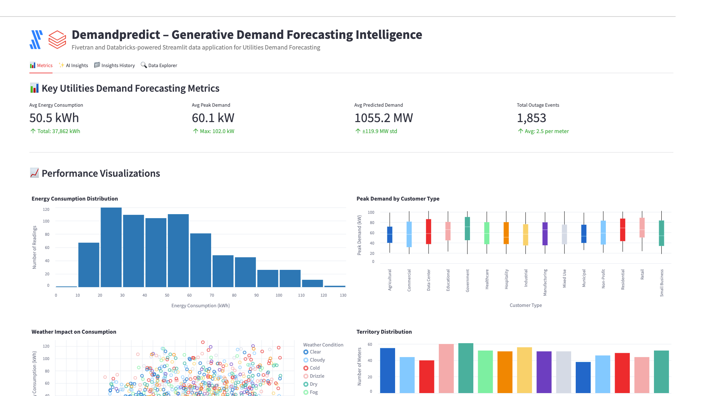

# DemandPredict – AI-Driven Demand Forecasting and Management



A Fivetran and Databricks-powered Streamlit application for Energy Demand Forecasting Optimization with advanced AI Agent Workflows.

## Overview

DemandPredict is an intelligent demand forecasting system that helps utilities automate the manual and time-consuming process of analyzing smart meter readings, weather data, and energy consumption patterns. This Databricks Streamlit application helps Directors of Demand Management, Chief Technology Officers, and Grid Operators reduce energy waste, optimize resource allocation, and prevent power outages through real-time analysis of smart grid data.

The application features sophisticated AI Agent Workflows that provide transparent, step-by-step analysis of demand forecasting data, transforming complex energy prediction models and grid optimization strategies into actionable insights and predictive load management recommendations. Each analysis focus area operates through specialized mini-agents that simulate the decision-making process of experienced demand management professionals and grid operators.

The application utilizes a synthetic utilities dataset that simulates data from smart meter platforms, weather forecasting services, and customer information systems. This synthetic data is moved into Databricks using a custom connector built with the Fivetran Connector SDK, enabling reliable and efficient data pipelines for demand forecasting analytics through Unity Catalog.

## AI Agent Workflows

### Agent Architecture Overview

DemandPredict employs a sophisticated multi-agent architecture designed specifically for energy demand forecasting optimization analysis. Each focus area operates through specialized AI agents that break down complex energy consumption analysis and grid optimization tasks into transparent, sequential steps that mirror the thought processes of experienced demand management professionals and utility operators.

### Focus Area Agents

#### Overall Performance Agent
**Business Challenge**: Utility Directors and Chief Technology Officers manually review hundreds of smart meter readings, weather data points, and demand forecasts daily, spending 4+ hours analyzing energy consumption patterns, peak demand trends, and outage correlations to identify grid optimization opportunities and demand prediction accuracy.

**Agent Solution**: Autonomous demand forecasting workflow that analyzes smart meter data, weather patterns, consumption metrics, and grid performance to generate automated demand summaries, identify peak demand risks, and produce prioritized grid optimization insights with predictive load management recommendations.

**Agent Workflow Steps**:
1. **Demand Forecasting Data Initialization** - Loading comprehensive demand forecasting dataset with enhanced validation across meter readings and grid metrics
2. **Energy Consumption Assessment** - Advanced calculation of demand forecasting indicators with consumption analysis
3. **Grid Performance Pattern Recognition** - Sophisticated identification of demand patterns with consumption correlation analysis
4. **AI Demand Intelligence Processing** - Processing comprehensive demand data through selected Databricks serving endpoint with advanced reasoning
5. **Demand Forecasting Report Compilation** - Professional demand forecasting analysis with evidence-based recommendations and actionable grid insights

#### Optimization Opportunities Agent
**Business Challenge**: Grid Operators and Demand Management teams spend 5+ hours daily manually identifying inefficiencies in energy distribution, load balancing strategies, and peak demand management across multiple service territories and weather conditions.

**Agent Solution**: AI-powered demand forecasting optimization analysis that automatically detects grid performance gaps, energy waste opportunities, and load balancing improvements with specific implementation recommendations for Itron, Sensus, and Landis+Gyr smart meter integration.

**Agent Workflow Steps**:
1. **Demand Optimization Data Preparation** - Advanced loading of demand forecasting data with enhanced validation for grid efficiency identification
2. **Grid Performance Inefficiency Detection** - Sophisticated analysis of demand forecasting strategies and grid performance with evidence-based inefficiency identification
3. **Energy Consumption Correlation Analysis** - Enhanced examination of relationships between weather conditions, customer types, and demand performance rates
4. **Smart Meter Integration Optimization** - Comprehensive evaluation of demand forecasting integration with existing Itron, Sensus, and Landis+Gyr smart meter systems
5. **AI Demand Intelligence** - Generating advanced demand optimization recommendations using selected Databricks model with grid reasoning
6. **Grid Strategy Finalization** - Professional demand optimization report with prioritized implementation roadmap and grid impact analysis

#### Financial Impact Agent
**Business Challenge**: Chief Financial Officers manually calculate complex ROI metrics across energy demand management activities and grid efficiency performance, requiring 4+ hours of financial modeling to assess operational costs and demand prediction effectiveness across the utility portfolio.

**Agent Solution**: Automated demand forecasting financial analysis that calculates comprehensive grid efficiency ROI, identifies cost reduction opportunities across energy operations, and projects demand management benefits with detailed savings forecasting.

**Agent Workflow Steps**:
1. **Demand Financial Data Integration** - Advanced loading of demand financial data and grid cost metrics with enhanced validation across meter readings
2. **Energy Cost-Benefit Calculation** - Sophisticated ROI metrics calculation with demand analysis and grid efficiency cost savings
3. **Grid Efficiency Impact Assessment** - Enhanced analysis of energy revenue impact with demand metrics and grid correlation analysis
4. **Energy Operations Efficiency Analysis** - Comprehensive evaluation of operational cost efficiency across demand activities with grid lifecycle cost optimization
5. **AI Demand Financial Modeling** - Advanced demand forecasting financial projections and ROI calculations using selected Databricks model
6. **Energy Economics Report Generation** - Professional demand financial impact analysis with detailed grid ROI calculations and energy cost forecasting

#### Strategic Recommendations Agent
**Business Challenge**: Chief Technology Officers spend hours manually analyzing digital transformation opportunities and developing strategic demand forecasting roadmaps for grid modernization and smart meter implementation across utility operations.

**Agent Solution**: Strategic demand forecasting intelligence workflow that analyzes competitive advantages against traditional grid management processes, identifies AI and predictive analytics integration opportunities, and creates prioritized digital grid transformation roadmaps.

**Agent Workflow Steps**:
1. **Grid Technology Assessment** - Advanced loading of demand forecasting digital context with competitive positioning analysis across meter readings and active smart meters
2. **Demand Competitive Advantage Analysis** - Sophisticated evaluation of competitive positioning against traditional demand forecasting with AI-powered grid optimization effectiveness
3. **Advanced Grid Technology Integration** - Enhanced analysis of integration opportunities with weather analytics, real-time demand monitoring, and AI-powered smart grid sensing across energy data dimensions
4. **Digital Grid Strategy Development** - Comprehensive development of prioritized digital transformation roadmap with evidence-based grid technology adoption strategies
5. **AI Demand Strategic Processing** - Advanced demand forecasting strategic recommendations using selected Databricks model with long-term competitive positioning
6. **Digital Grid Report Generation** - Professional digital grid transformation roadmap with competitive analysis and demand technology implementation plan ready for CTO executive review

### Agent Execution Flow

1. **Agent Initialization** - User selects focus area and Databricks serving endpoint, triggering specialized agent activation
2. **Unity Catalog Data Context Loading** - Agent accesses smart meter data, weather patterns, and consumption metrics from Unity Catalog
3. **Step-by-Step Processing** - Agent executes sequential workflow steps with real-time progress visualization
4. **Demand Intelligence Integration** - Selected Databricks serving endpoint processes energy context with specialized prompting
5. **Results Compilation** - Agent generates comprehensive demand forecasting analysis with actionable grid recommendations
6. **Report Delivery** - Professional demand forecasting report delivered with implementation roadmap and success metrics

## Data Sources

The application is designed to work with data from major smart meter platforms and energy management systems:

### Energy Data Sources (Simulated)
- **Smart Meter Platforms**: 
  - Itron
  - Sensus
  - Landis+Gyr
- **Weather Forecasting**: 
  - The Weather Company
  - AccuWeather
  - DTN
- **Customer Information Systems**:
  - Oracle Utilities Customer Care and Billing
  - SAP IS-U
  - Siebel CRM
- **Grid Management Systems**:
  - Schneider Electric EcoStruxure
  - GE Digital Grid Solutions
  - ABB Ability
- **Energy Trading Platforms**:
  - ERCOT
  - PJM Interconnection
  - ISO New England
- **Advanced Metering Infrastructure**:
  - Honeywell Elster
  - Aclara Technologies
  - Kamstrup

For demonstration and development purposes, we've created a synthetic dataset that approximates these data sources and combined them into a single table exposed through Unity Catalog. This approach allows for realistic demand forecasting analytics without using proprietary utility data.

## Key Features

- **AI Agent Workflows**: Transparent, step-by-step demand forecasting analysis through specialized mini-agents for each focus area
- **Agent Progress Visualization**: Real-time display of agent processing steps with energy context and completion tracking
- **Focus Area Specialization**: Dedicated agents for Overall Performance, Optimization Opportunities, Financial Impact, and Strategic Recommendations
- **Databricks Serving Endpoints Integration**: Seamless integration with multiple Databricks LLM serving endpoints for specialized energy analysis
- **AI-powered demand prediction**: Leverages generative AI to analyze energy patterns and automatically generate optimized forecasting models with key insights
- **Unity Catalog data management**: Integrated data governance and lineage tracking for all demand forecasting analytics
- **Integration with synthetic utility data**: Simulates data from major smart meter platforms, weather forecasting services, and grid management providers
- **Comprehensive data application**: Visual representation of key metrics including energy consumption, peak demand, voltage stability, and weather correlation analysis
- **Custom Fivetran connector**: Utilizes a custom connector built with the Fivetran Connector SDK to reliably move data from the API server to Databricks

## Databricks Streamlit App Sections

### Metrics
- **Key Performance Indicators**: Track Average Energy Consumption, Peak Demand, Predicted Demand, and Total Outage Events
- **Grid Analytics**: Monitor service territories, usage trends, and demand forecasting efficiency
- **Energy Consumption Distribution**: Visualize consumption patterns across customer segments
- **Peak Demand Analysis**: Analyze peak demand by customer type with comprehensive visualizations
- **Weather Impact**: Track temperature correlation and weather condition effects on energy consumption
- **Voltage Stability**: Review voltage level distribution across power factor patterns
- **Prediction Accuracy**: Monitor demand prediction accuracy correlation with actual peak demand
- **Customer Satisfaction**: Assess social media sentiment vs customer complaint relationships

### AI Insights with Agent Workflows
Generate AI-powered insights through transparent agent workflows with different focus areas:
- **Overall Performance**: Comprehensive analysis of the demand forecasting and grid optimization system through autonomous energy workflow
- **Optimization Opportunities**: Areas where energy efficiency and grid stability can be improved via AI-powered demand optimization analysis
- **Financial Impact**: Cost-benefit analysis and ROI in energy management terms through automated demand financial analysis
- **Strategic Recommendations**: Long-term strategic implications for digital transformation via strategic demand intelligence workflow

Each focus area includes:
- **Business Challenge Description**: Detailed explanation of the specific demand forecasting problem being addressed
- **Agent Solution Overview**: Description of how the AI agent workflow solves the energy challenge
- **Real-time Progress Tracking**: Step-by-step visualization of agent processing with energy context
- **Agent Execution Controls**: Start/stop controls for managing agent workflow execution
- **Professional Energy Reports**: Comprehensive analysis reports with implementation roadmaps

### Insights History
Access previously generated agent-driven insights for reference and comparison, including agent execution details and Databricks model selection.

### Data Explorer
Explore the underlying demand forecasting data from Unity Catalog with pagination controls.

## Setup Instructions

### Databricks Environment Prerequisites

1. **Databricks Workspace**: Ensure you have access to a Databricks workspace with Unity Catalog enabled
2. **Unity Catalog Configuration**: 
   - Catalog: Set up your Unity Catalog (e.g., `ts-catalog-demo`)
   - Schema: Create schema for utilities data (e.g., `utl_connector_dbx_utilities`)
   - Table: Ensure `utl_records` table exists with proper permissions
3. **Databricks Serving Endpoints**: Configure LLM serving endpoints for AI agent functionality
4. **Environment Variables**: Set the following in your Databricks environment:
   ```
   DATABRICKS_HOST=<your-databricks-host>
   DATABRICKS_SQL_HTTP_PATH=<your-sql-warehouse-http-path>
   DATABRICKS_TOKEN=<your-access-token>
   UC_CATALOG=<your-unity-catalog-name>
   UC_SCHEMA=<your-schema-name>
   UC_TABLE=utl_records
   ```

### Databricks Streamlit App Deployment

1. **Navigate to Databricks Workspace**
2. **Create New Streamlit App**:
   - Go to **Apps** → **Streamlit**
   - Click **Create App**
3. **Configure App Settings**:
   - **Name**: DemandPredict Utilities Forecasting
   - **Warehouse**: Select your SQL warehouse
   - **Unity Catalog**: Set catalog and schema context
4. **Upload Application Code**:
   - Copy the `app.py` content into the Streamlit editor
   - Ensure all dependencies are included
5. **Configure Environment Variables** as listed above
6. **Deploy and Test**: Deploy the application and verify connection to Unity Catalog

### Fivetran Data Movement Setup

1. **API Server Setup**: Ensure the API server hosting the synthetic utility data is operational
2. **Custom Fivetran Connector**: 
   - Configure the custom Fivetran connector (built with Fivetran Connector SDK)
   - Connect to the API server
   - Set destination as your Databricks workspace
3. **Unity Catalog Integration**:
   - Configure Fivetran to write data to your Unity Catalog
   - Set target table as `<catalog>.<schema>.utl_records`
4. **Data Pipeline Activation**:
   - Start the Fivetran sync in the Fivetran UI
   - Verify data is being loaded correctly into Unity Catalog
   - Monitor data quality and sync status

## Data Flow

1. **Synthetic Data Creation**: A synthetic dataset approximating real utility data sources has been created and exposed via an API server:
   - Smart Meter Platforms: Itron, Sensus, Landis+Gyr
   - Weather Forecasting: The Weather Company, AccuWeather, DTN
   - Customer Information Systems: Oracle Utilities, SAP IS-U, Siebel CRM

2. **Custom Data Integration**: A custom connector built with the Fivetran Connector SDK communicates with the API server to extract the synthetic utility data

3. **Automated Data Movement**: Fivetran manages the orchestration and scheduling of data movement from the API server into Databricks

4. **Unity Catalog Data Loading**: The synthetic utility data is loaded into Unity Catalog as a `utl_records` table with proper governance and lineage tracking

5. **Agent Workflow Execution**: AI agents process the demand forecasting data through specialized workflows, providing transparent step-by-step analysis

6. **Databricks Analytics**: Databricks SQL and Databricks serving endpoints analyze the data to generate insights through agent-driven processes

7. **Data Visualization**: Databricks Streamlit presents the analyzed data in an interactive application with agent workflow visualization

## Data Requirements

The application expects a table named `utl_records` in Unity Catalog which contains synthetic data simulating various smart meter and utility management systems. This data is retrieved from an API server using a custom Fivetran connector built with the Fivetran Connector SDK:

### Unity Catalog Table Schema: `<catalog>.<schema>.utl_records`

#### Smart Meter Data
- `record_id` (String)
- `meter_id` (String)
- `customer_id` (String)
- `timestamp` (Timestamp)
- `energy_consumption_kwh` (Double)
- `peak_demand_kw` (Double)
- `voltage_level` (Double)
- `power_factor` (Double)

#### Weather and Environmental Data
- `temperature_fahrenheit` (Double)
- `humidity_percent` (Double)
- `wind_speed_mph` (Double)
- `weather_condition` (String)

#### Customer and Service Data
- `customer_type` (String)
- `service_territory` (String)
- `rate_schedule` (String)
- `billing_cycle_day` (Integer)

#### Grid Performance and Analytics
- `outage_events` (Integer)
- `social_media_sentiment` (Double)
- `customer_complaints` (Integer)
- `predicted_demand_mw` (Double)

#### Fivetran Metadata
- `_fivetran_deleted` (Boolean)
- `_fivetran_synced` (Timestamp)

## Benefits

- **$1,500,000 in annual cost savings**: $5,000,000 annual energy costs × 30% reduction = $1,500,000 savings/year
- **10% reduction in energy waste**: 10,000 MWh energy consumption × 10% reduction = 1,000 MWh saved
- **20% increase in customer satisfaction**: 80,000 customers × 20% increase = 16,000 additional satisfied customers
- **5% reduction in peak demand**: 10,000 MW peak demand × 5% reduction = 500 MW reduced peak demand
- **Enhanced Grid Transparency**: Agent workflows provide clear visibility into demand forecasting analysis reasoning and decision-making processes
- **Accelerated Energy Insights**: Automated agent processing reduces manual analysis time from hours to minutes for complex demand assessments
- **Unity Catalog Governance**: Comprehensive data lineage and governance for all demand forecasting analytics
- **Scalable Databricks Architecture**: Leverage Databricks' elastic compute and storage for growing data volumes

## Technical Details

This application uses:
- **AI Agent Workflow Engine**: Custom agent orchestration system for transparent, step-by-step demand forecasting analysis
- **Multi-Agent Architecture**: Specialized agents for different energy focus areas with domain-specific processing
- **Agent Progress Visualization**: Real-time display of agent execution steps with energy context and completion tracking
- **Databricks Streamlit** for the user interface with enhanced agent workflow displays
- **Databricks Serving Endpoints** for AI-powered insights generation through agent-managed prompting
- **Multiple LLM models** including Claude 4 Sonnet, Claude 3.5 Sonnet, Llama 3.1/3.3, Gemma, and more for agent intelligence
- **Databricks SQL** for data processing within agent workflows
- **Unity Catalog** for data governance, lineage tracking, and access control
- **Fivetran Connector SDK** for building a custom connector to retrieve synthetic utility data from an API server
- **Custom Fivetran connector** for automated, reliable data movement into Databricks

### Databricks Serving Endpoints Configuration

The application supports multiple Databricks serving endpoints:
- `databricks-claude-sonnet-4`
- `databricks-claude-opus-4`
- `databricks-claude-3-7-sonnet`
- `databricks-meta-llama-3-1-8b-instruct`
- `databricks-meta-llama-3-3-70b-instruct`
- `databricks-gemma-3-12b`
- `databricks-llama-4-maverick`
- `databricks-gpt-oss-120b`

Each endpoint is optimized for specific types of demand forecasting analysis and can be selected based on the complexity and requirements of the analysis task.

## Success Metrics

- Demand accuracy improvement
- Energy waste reduction
- Customer satisfaction enhancement
- Peak demand reduction
- Grid reliability optimization
- **Agent Workflow Efficiency**: Time reduction from manual demand analysis to automated agent-driven insights
- **Energy Transparency Score**: User confidence in forecasting recommendations through visible agent reasoning
- **Grid Optimization Accuracy**: Improvement in demand prediction success rates through systematic agent processing
- **Databricks Performance Metrics**: Query performance, model serving latency, and Unity Catalog access patterns

## Key Stakeholders

- Director of Demand Management
- Chief Technology Officer (CTO)
- Chief Customer Officer
- Grid Operations Managers
- Energy Trading Analysts
- Utility Data Scientists
- Demand Response Coordinators
- Smart Grid Engineers
- Regulatory Affairs Teams
- **Energy Operations Analysts**: Professionals who benefit from transparent agent workflow visibility
- **Demand Forecasting Teams**: Staff who implement agent-recommended grid optimization strategies
- **Databricks Platform Teams**: Technical staff managing Unity Catalog and serving endpoints

## Competitive Advantage

DemandPredict differentiates itself by leveraging generative AI with transparent agent workflows to automate the demand forecasting process, reducing manual labor and increasing the speed of insights. The agent-based architecture provides unprecedented visibility into energy analysis reasoning, building trust and confidence in AI-driven forecasting decisions. This creates a competitive advantage by enabling faster decision-making and improved grid optimization in utility operations while maintaining complete transparency in the analysis process.

The integration with Databricks provides additional competitive advantages through:
- **Unified Analytics Platform**: Single platform for data engineering, analytics, and ML operations
- **Unity Catalog Governance**: Enterprise-grade data governance and security
- **Elastic Scalability**: Auto-scaling compute resources for varying demand forecasting workloads
- **Advanced ML Capabilities**: Built-in MLflow integration for model lifecycle management

Proactive demand forecasting strategies reduce energy waste and improve grid reliability through predictive analytics that optimize resource allocation and prevent power outages.

## Risk Assessment

Potential implementation challenges include data quality issues, model bias, integration with existing grid management systems, and Databricks platform configuration complexity. Mitigation strategies include:

- **Data Quality**: Implement data validation rules in Unity Catalog and monitor data quality through Fivetran
- **Model Bias**: Regular model evaluation and retraining using Databricks MLflow
- **System Integration**: Phased rollout with existing utility infrastructure and close collaboration with demand management teams
- **Platform Complexity**: Comprehensive training for utility staff on Databricks and Unity Catalog usage
- **Security and Compliance**: Leverage Unity Catalog's built-in security features for regulatory compliance

## Long-term Evolution

DemandPredict will evolve to incorporate advanced generative AI techniques, such as transfer learning, to adapt to changing customer behavior and weather patterns. In the next 3-5 years, the system will expand to include:

- **Multi-modal Agent Learning**: Agents that can process weather forecasting, smart meter data, and grid communications from diverse utility systems
- **Collaborative Agent Networks**: Multiple agents working together to solve complex demand forecasting challenges across different service territories
- **Adaptive Agent Intelligence**: Self-improving agents that learn from energy outcomes and refine their analytical approaches using Databricks AutoML
- **Advanced Agent Orchestration**: Sophisticated workflow management for complex, multi-step energy analysis processes
- **Integration with Emerging Grid Technologies**: Agent connectivity with IoT devices, real-time weather sensors, and automated demand response systems for comprehensive energy intelligence
- **Databricks Lakehouse Evolution**: Expand to leverage Delta Lake for real-time streaming analytics and Unity Catalog for cross-cloud data sharing

The system will expand to include integration with emerging technologies like IoT devices for real-time grid monitoring and predictive analytics for renewable energy integration, all orchestrated through advanced agent workflows that provide complete transparency and control over the demand forecasting analysis process. Unity Catalog will enable seamless data sharing across the entire utility ecosystem while maintaining governance and security standards.